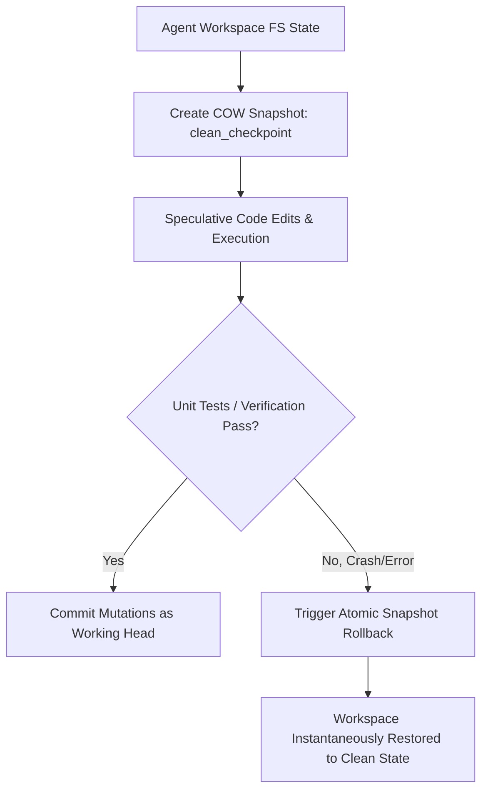

# GenPark AI Agent Skill - Virtual In-Memory FS Copy-On-Write Snapshotter

In-memory virtual filesystem with instant copy-on-write (COW) branching and atomic rollback for speculative agent code generation.

Verified by [GenPark AI](https://genpark.ai) and compatible with [Model Context Protocol (MCP)](https://genpark.ai/mcp).

## Architecture Diagram

## Features
- **Zero-Latency State Rollback**: Allows autonomous agents to test dangerous refactors without disk pollution.
- **Zero External Dependencies**: Pure Python 3.9+ standard library.
